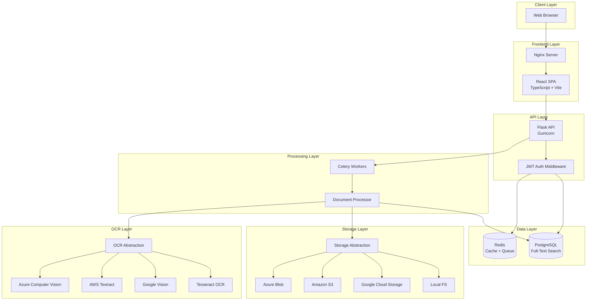
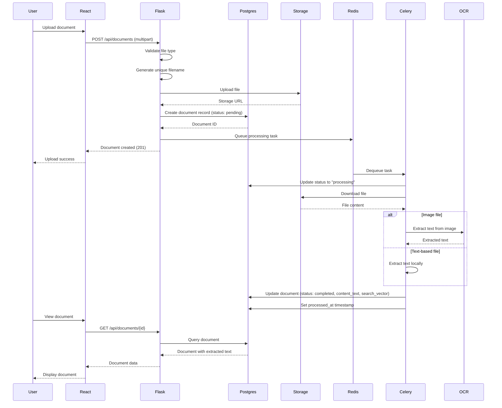
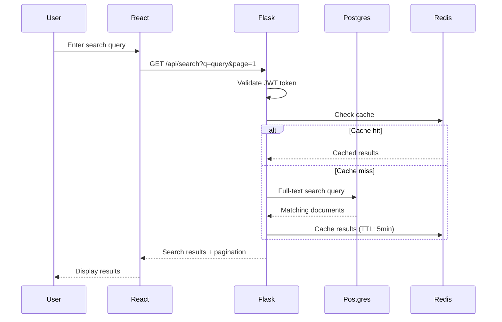
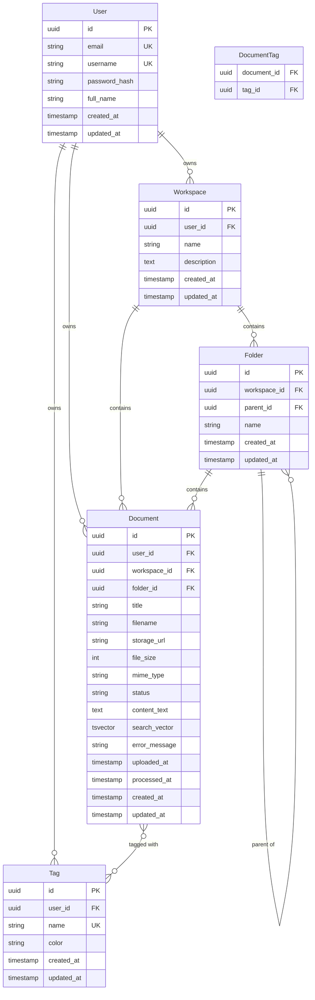

# Technical Design Document: Cortex Platform

## Overview

Cortex is a cloud-agnostic document processing platform that provides comprehensive document management capabilities including upload, OCR processing, text extraction, full-text search, and hierarchical organization. The system is architected as a modern full-stack application with clear separation of concerns and provider abstraction layers that enable deployment across multiple cloud platforms or on-premises infrastructure without code changes.

### Key Design Principles

1. **Cloud Agnosticism**: Provider abstraction layers for storage and OCR enable deployment flexibility
2. **Asynchronous Processing**: Background workers handle compute-intensive tasks without blocking user requests
3. **Scalability**: Stateless API design, connection pooling, and caching support horizontal scaling
4. **Security**: Multi-layered security with JWT authentication, bcrypt password hashing, and user isolation
5. **Extensibility**: Plugin-style provider architecture allows easy addition of new storage and OCR backends

### Technology Stack

**Frontend:**
- React 18 with TypeScript for type-safe UI development
- Vite for fast development and optimized production builds
- TanStack Query for server state management and caching
- Tailwind CSS for utility-first styling
- React Router for client-side routing

**Backend:**
- Flask (Python) for RESTful API
- SQLAlchemy ORM with Alembic migrations
- PostgreSQL for primary data storage with full-text search
- Redis for caching and message brokering
- Celery for asynchronous task processing
- Gunicorn for production WSGI server

**Infrastructure:**
- Docker Compose for containerized deployment
- Nginx for frontend serving and reverse proxy
- Provider SDKs: Google Cloud, AWS, Azure

## Architecture

### High-Level System Architecture



### Component Architecture

The system follows a layered architecture with clear separation between presentation, business logic, data access, and external services.

**Presentation Layer (Frontend):**
- React components organized by feature (auth, documents, workspaces, folders, tags, search)
- TanStack Query hooks for API integration and optimistic updates
- React Router for declarative routing and protected routes
- Tailwind CSS for responsive, mobile-first design

**API Layer (Backend):**
- Flask blueprints for modular route organization (auth, documents, workspaces, folders, tags, search, analytics)
- JWT middleware for authentication and authorization
- Request validation and error handling middleware
- SQLAlchemy models for database entities

**Service Layer:**
- Document processing service with text extraction logic
- Provider factory pattern for storage and OCR selection
- Authentication service for user management and token generation

**Data Access Layer:**
- SQLAlchemy ORM for database operations
- Repository pattern for complex queries
- Database connection pooling for performance

**Worker Layer:**
- Celery tasks for asynchronous document processing
- Retry logic with exponential backoff
- Shared database and storage provider access

### Data Flow

#### Document Upload and Processing Flow



#### Search Flow



## Components and Interfaces

### Frontend Components

#### Core Components

**AuthProvider**
- Manages authentication state and JWT token storage
- Provides login, logout, and token refresh functionality
- Wraps application with authentication context

**ProtectedRoute**
- Guards routes requiring authentication
- Redirects unauthenticated users to login
- Validates token expiration

**DocumentUploader**
- Drag-and-drop file upload interface
- File type validation
- Progress indication
- Workspace and folder assignment

**DocumentList**
- Paginated document grid/list view
- Filtering by status, workspace, folder
- Sorting by date, title, size
- Bulk operations support

**SearchInterface**
- Real-time search with debouncing
- Filter controls (workspace, status)
- Result highlighting
- Pagination

**WorkspaceManager**
- CRUD operations for workspaces
- Document and folder counts
- Nested folder tree view

**TagManager**
- Tag creation with color picker
- Tag assignment to documents
- Visual tag display with colors

#### API Integration Layer

**API Client (`src/lib/api.ts`)**
```typescript
interface ApiClient {
  // Authentication
  login(email: string, password: string): Promise<AuthResponse>
  register(userData: RegisterData): Promise<AuthResponse>
  refreshToken(): Promise<TokenResponse>
  
  // Documents
  uploadDocument(file: File, metadata: DocumentMetadata): Promise<Document>
  listDocuments(params: ListParams): Promise<PaginatedResponse<Document>>
  getDocument(id: string): Promise<Document>
  updateDocument(id: string, updates: DocumentUpdate): Promise<Document>
  deleteDocument(id: string): Promise<void>
  reprocessDocument(id: string): Promise<Document>
  
  // Search
  searchDocuments(query: string, filters: SearchFilters): Promise<PaginatedResponse<Document>>
  
  // Workspaces
  createWorkspace(data: WorkspaceCreate): Promise<Workspace>
  listWorkspaces(): Promise<Workspace[]>
  updateWorkspace(id: string, updates: WorkspaceUpdate): Promise<Workspace>
  deleteWorkspace(id: string): Promise<void>
  
  // Folders
  createFolder(data: FolderCreate): Promise<Folder>
  listFolders(workspaceId: string): Promise<Folder[]>
  updateFolder(id: string, updates: FolderUpdate): Promise<Folder>
  deleteFolder(id: string): Promise<void>
  
  // Tags
  createTag(data: TagCreate): Promise<Tag>
  listTags(): Promise<Tag[]>
  updateTag(id: string, updates: TagUpdate): Promise<Tag>
  deleteTag(id: string): Promise<void>
  
  // Analytics
  getDashboard(): Promise<DashboardData>
}
```

### Backend API Endpoints

#### Authentication Endpoints

```
POST   /api/auth/register          - Register new user
POST   /api/auth/login             - Authenticate user
POST   /api/auth/refresh           - Refresh access token
GET    /api/auth/me                - Get current user profile
PUT    /api/auth/me                - Update user profile
```

#### Document Endpoints

```
POST   /api/documents              - Upload document
GET    /api/documents              - List documents (paginated, filtered)
GET    /api/documents/{id}         - Get document details
PUT    /api/documents/{id}         - Update document metadata
DELETE /api/documents/{id}         - Delete document
POST   /api/documents/{id}/reprocess - Trigger reprocessing
```

#### Search Endpoints

```
GET    /api/search                 - Search documents
```

#### Workspace Endpoints

```
POST   /api/workspaces             - Create workspace
GET    /api/workspaces             - List workspaces
GET    /api/workspaces/{id}        - Get workspace details
PUT    /api/workspaces/{id}        - Update workspace
DELETE /api/workspaces/{id}        - Delete workspace
```

#### Folder Endpoints

```
POST   /api/folders                - Create folder
GET    /api/folders                - List folders (filtered by workspace)
GET    /api/folders/{id}           - Get folder details
PUT    /api/folders/{id}           - Update folder
DELETE /api/folders/{id}           - Delete folder
```

#### Tag Endpoints

```
POST   /api/tags                   - Create tag
GET    /api/tags                   - List tags
GET    /api/tags/{id}              - Get tag details
PUT    /api/tags/{id}              - Update tag
DELETE /api/tags/{id}              - Delete tag
```

#### Analytics Endpoints

```
GET    /api/analytics/dashboard    - Get dashboard statistics
```

#### Health Check Endpoints

```
GET    /api/health                 - System health check
```

### Provider Abstraction Interfaces

#### Storage Provider Interface

```python
class StorageProvider(ABC):
    """Abstract base class for storage providers"""
    
    @abstractmethod
    def upload(self, file_data: bytes, filename: str) -> str:
        """
        Upload file and return storage URL/path
        
        Args:
            file_data: Binary file content
            filename: Destination filename
            
        Returns:
            Storage URL or path
            
        Raises:
            StorageError: If upload fails
        """
        pass
    
    @abstractmethod
    def download(self, filename: str) -> bytes:
        """
        Download file content
        
        Args:
            filename: File to download
            
        Returns:
            Binary file content
            
        Raises:
            StorageError: If download fails
        """
        pass
    
    @abstractmethod
    def delete(self, filename: str) -> None:
        """
        Delete file from storage
        
        Args:
            filename: File to delete
            
        Raises:
            StorageError: If deletion fails
        """
        pass
```

**Implementations:**
- `LocalStorageProvider`: Filesystem-based storage
- `GCSStorageProvider`: Google Cloud Storage
- `S3StorageProvider`: Amazon S3
- `AzureBlobStorageProvider`: Azure Blob Storage

#### OCR Provider Interface

```python
class OCRProvider(ABC):
    """Abstract base class for OCR providers"""
    
    @abstractmethod
    def extract_text(self, image_data: bytes, mime_type: str) -> str:
        """
        Extract text from image using OCR
        
        Args:
            image_data: Binary image content
            mime_type: Image MIME type
            
        Returns:
            Extracted text content
            
        Raises:
            OCRError: If extraction fails
        """
        pass
```

**Implementations:**
- `TesseractOCRProvider`: Local Tesseract OCR
- `GoogleVisionOCRProvider`: Google Cloud Vision API
- `AWSTextractOCRProvider`: AWS Textract
- `AzureComputerVisionOCRProvider`: Azure Computer Vision

### Service Layer

#### Document Processing Service

```python
class DocumentProcessor:
    """Service for processing documents and extracting text"""
    
    def __init__(self, storage_provider: StorageProvider, ocr_provider: OCRProvider):
        self.storage = storage_provider
        self.ocr = ocr_provider
    
    def process_document(self, document_id: str) -> None:
        """
        Process document and extract text content
        
        Args:
            document_id: UUID of document to process
            
        Updates document status and content in database
        """
        pass
    
    def extract_text_from_pdf(self, file_data: bytes) -> str:
        """Extract text from PDF using PyPDF2"""
        pass
    
    def extract_text_from_docx(self, file_data: bytes) -> str:
        """Extract text from DOCX using python-docx"""
        pass
    
    def extract_text_from_text_file(self, file_data: bytes) -> str:
        """Extract text from TXT/MD files"""
        pass
    
    def extract_text_from_image(self, file_data: bytes, mime_type: str) -> str:
        """Extract text from image using OCR provider"""
        pass
```

#### Authentication Service

```python
class AuthService:
    """Service for user authentication and authorization"""
    
    def register_user(self, email: str, username: str, password: str, full_name: str = None) -> User:
        """Register new user with hashed password"""
        pass
    
    def authenticate_user(self, email: str, password: str) -> tuple[User, str, str]:
        """Authenticate user and return access + refresh tokens"""
        pass
    
    def generate_access_token(self, user_id: str) -> str:
        """Generate JWT access token"""
        pass
    
    def generate_refresh_token(self, user_id: str) -> str:
        """Generate JWT refresh token"""
        pass
    
    def verify_token(self, token: str) -> dict:
        """Verify and decode JWT token"""
        pass
    
    def hash_password(self, password: str) -> str:
        """Hash password using bcrypt"""
        pass
    
    def verify_password(self, password: str, hashed: str) -> bool:
        """Verify password against bcrypt hash"""
        pass
```


## Data Models

### Entity Relationship Diagram



### Database Schema

#### Users Table

```sql
CREATE TABLE users (
    id UUID PRIMARY KEY DEFAULT gen_random_uuid(),
    email VARCHAR(255) NOT NULL UNIQUE,
    username VARCHAR(100) NOT NULL UNIQUE,
    password_hash VARCHAR(255) NOT NULL,
    full_name VARCHAR(255),
    created_at TIMESTAMP WITH TIME ZONE DEFAULT CURRENT_TIMESTAMP,
    updated_at TIMESTAMP WITH TIME ZONE DEFAULT CURRENT_TIMESTAMP
);

CREATE INDEX idx_users_email ON users(email);
CREATE INDEX idx_users_username ON users(username);
```

#### Documents Table

```sql
CREATE TABLE documents (
    id UUID PRIMARY KEY DEFAULT gen_random_uuid(),
    user_id UUID NOT NULL REFERENCES users(id) ON DELETE CASCADE,
    workspace_id UUID REFERENCES workspaces(id) ON DELETE SET NULL,
    folder_id UUID REFERENCES folders(id) ON DELETE SET NULL,
    title VARCHAR(500) NOT NULL,
    filename VARCHAR(500) NOT NULL,
    storage_url TEXT NOT NULL,
    file_size INTEGER NOT NULL,
    mime_type VARCHAR(100) NOT NULL,
    status VARCHAR(20) NOT NULL DEFAULT 'pending',
    content_text TEXT,
    search_vector TSVECTOR,
    error_message TEXT,
    uploaded_at TIMESTAMP WITH TIME ZONE DEFAULT CURRENT_TIMESTAMP,
    processed_at TIMESTAMP WITH TIME ZONE,
    created_at TIMESTAMP WITH TIME ZONE DEFAULT CURRENT_TIMESTAMP,
    updated_at TIMESTAMP WITH TIME ZONE DEFAULT CURRENT_TIMESTAMP,
    
    CONSTRAINT chk_status CHECK (status IN ('pending', 'processing', 'completed', 'failed'))
);

CREATE INDEX idx_documents_user_id ON documents(user_id);
CREATE INDEX idx_documents_workspace_id ON documents(workspace_id);
CREATE INDEX idx_documents_folder_id ON documents(folder_id);
CREATE INDEX idx_documents_status ON documents(status);
CREATE INDEX idx_documents_created_at ON documents(created_at DESC);
CREATE INDEX idx_documents_mime_type ON documents(mime_type);
CREATE INDEX idx_documents_search_vector ON documents USING GIN(search_vector);

-- Trigger to update search_vector
CREATE TRIGGER documents_search_vector_update
BEFORE INSERT OR UPDATE OF title, content_text
ON documents
FOR EACH ROW
EXECUTE FUNCTION tsvector_update_trigger(search_vector, 'pg_catalog.english', title, content_text);
```

#### Workspaces Table

```sql
CREATE TABLE workspaces (
    id UUID PRIMARY KEY DEFAULT gen_random_uuid(),
    user_id UUID NOT NULL REFERENCES users(id) ON DELETE CASCADE,
    name VARCHAR(255) NOT NULL,
    description TEXT,
    created_at TIMESTAMP WITH TIME ZONE DEFAULT CURRENT_TIMESTAMP,
    updated_at TIMESTAMP WITH TIME ZONE DEFAULT CURRENT_TIMESTAMP
);

CREATE INDEX idx_workspaces_user_id ON workspaces(user_id);
```

#### Folders Table

```sql
CREATE TABLE folders (
    id UUID PRIMARY KEY DEFAULT gen_random_uuid(),
    workspace_id UUID NOT NULL REFERENCES workspaces(id) ON DELETE CASCADE,
    parent_id UUID REFERENCES folders(id) ON DELETE CASCADE,
    name VARCHAR(255) NOT NULL,
    created_at TIMESTAMP WITH TIME ZONE DEFAULT CURRENT_TIMESTAMP,
    updated_at TIMESTAMP WITH TIME ZONE DEFAULT CURRENT_TIMESTAMP
);

CREATE INDEX idx_folders_workspace_id ON folders(workspace_id);
CREATE INDEX idx_folders_parent_id ON folders(parent_id);
```

#### Tags Table

```sql
CREATE TABLE tags (
    id UUID PRIMARY KEY DEFAULT gen_random_uuid(),
    user_id UUID NOT NULL REFERENCES users(id) ON DELETE CASCADE,
    name VARCHAR(100) NOT NULL,
    color VARCHAR(7) NOT NULL DEFAULT '#3B82F6',
    created_at TIMESTAMP WITH TIME ZONE DEFAULT CURRENT_TIMESTAMP,
    updated_at TIMESTAMP WITH TIME ZONE DEFAULT CURRENT_TIMESTAMP,
    
    CONSTRAINT uq_user_tag_name UNIQUE (user_id, name)
);

CREATE INDEX idx_tags_user_id ON tags(user_id);
```

#### Document_Tags Association Table

```sql
CREATE TABLE document_tags (
    document_id UUID NOT NULL REFERENCES documents(id) ON DELETE CASCADE,
    tag_id UUID NOT NULL REFERENCES tags(id) ON DELETE CASCADE,
    created_at TIMESTAMP WITH TIME ZONE DEFAULT CURRENT_TIMESTAMP,
    
    PRIMARY KEY (document_id, tag_id)
);

CREATE INDEX idx_document_tags_document_id ON document_tags(document_id);
CREATE INDEX idx_document_tags_tag_id ON document_tags(tag_id);
```

### SQLAlchemy Models

#### User Model

```python
class User(db.Model):
    __tablename__ = 'users'
    
    id = db.Column(UUID(as_uuid=True), primary_key=True, default=uuid.uuid4)
    email = db.Column(db.String(255), unique=True, nullable=False, index=True)
    username = db.Column(db.String(100), unique=True, nullable=False, index=True)
    password_hash = db.Column(db.String(255), nullable=False)
    full_name = db.Column(db.String(255))
    created_at = db.Column(db.DateTime(timezone=True), default=datetime.utcnow)
    updated_at = db.Column(db.DateTime(timezone=True), default=datetime.utcnow, onupdate=datetime.utcnow)
    
    # Relationships
    documents = db.relationship('Document', back_populates='user', cascade='all, delete-orphan')
    workspaces = db.relationship('Workspace', back_populates='user', cascade='all, delete-orphan')
    tags = db.relationship('Tag', back_populates='user', cascade='all, delete-orphan')
```

#### Document Model

```python
class Document(db.Model):
    __tablename__ = 'documents'
    
    id = db.Column(UUID(as_uuid=True), primary_key=True, default=uuid.uuid4)
    user_id = db.Column(UUID(as_uuid=True), db.ForeignKey('users.id'), nullable=False, index=True)
    workspace_id = db.Column(UUID(as_uuid=True), db.ForeignKey('workspaces.id'), index=True)
    folder_id = db.Column(UUID(as_uuid=True), db.ForeignKey('folders.id'), index=True)
    title = db.Column(db.String(500), nullable=False)
    filename = db.Column(db.String(500), nullable=False)
    storage_url = db.Column(db.Text, nullable=False)
    file_size = db.Column(db.Integer, nullable=False)
    mime_type = db.Column(db.String(100), nullable=False, index=True)
    status = db.Column(db.String(20), nullable=False, default='pending', index=True)
    content_text = db.Column(db.Text)
    search_vector = db.Column(TSVECTOR)
    error_message = db.Column(db.Text)
    uploaded_at = db.Column(db.DateTime(timezone=True), default=datetime.utcnow)
    processed_at = db.Column(db.DateTime(timezone=True))
    created_at = db.Column(db.DateTime(timezone=True), default=datetime.utcnow, index=True)
    updated_at = db.Column(db.DateTime(timezone=True), default=datetime.utcnow, onupdate=datetime.utcnow)
    
    # Relationships
    user = db.relationship('User', back_populates='documents')
    workspace = db.relationship('Workspace', back_populates='documents')
    folder = db.relationship('Folder', back_populates='documents')
    tags = db.relationship('Tag', secondary='document_tags', back_populates='documents')
```

#### Workspace Model

```python
class Workspace(db.Model):
    __tablename__ = 'workspaces'
    
    id = db.Column(UUID(as_uuid=True), primary_key=True, default=uuid.uuid4)
    user_id = db.Column(UUID(as_uuid=True), db.ForeignKey('users.id'), nullable=False, index=True)
    name = db.Column(db.String(255), nullable=False)
    description = db.Column(db.Text)
    created_at = db.Column(db.DateTime(timezone=True), default=datetime.utcnow)
    updated_at = db.Column(db.DateTime(timezone=True), default=datetime.utcnow, onupdate=datetime.utcnow)
    
    # Relationships
    user = db.relationship('User', back_populates='workspaces')
    folders = db.relationship('Folder', back_populates='workspace', cascade='all, delete-orphan')
    documents = db.relationship('Document', back_populates='workspace')
```

#### Folder Model

```python
class Folder(db.Model):
    __tablename__ = 'folders'
    
    id = db.Column(UUID(as_uuid=True), primary_key=True, default=uuid.uuid4)
    workspace_id = db.Column(UUID(as_uuid=True), db.ForeignKey('workspaces.id'), nullable=False, index=True)
    parent_id = db.Column(UUID(as_uuid=True), db.ForeignKey('folders.id'), index=True)
    name = db.Column(db.String(255), nullable=False)
    created_at = db.Column(db.DateTime(timezone=True), default=datetime.utcnow)
    updated_at = db.Column(db.DateTime(timezone=True), default=datetime.utcnow, onupdate=datetime.utcnow)
    
    # Relationships
    workspace = db.relationship('Workspace', back_populates='folders')
    parent = db.relationship('Folder', remote_side=[id], backref='children')
    documents = db.relationship('Document', back_populates='folder')
```

#### Tag Model

```python
class Tag(db.Model):
    __tablename__ = 'tags'
    
    id = db.Column(UUID(as_uuid=True), primary_key=True, default=uuid.uuid4)
    user_id = db.Column(UUID(as_uuid=True), db.ForeignKey('users.id'), nullable=False, index=True)
    name = db.Column(db.String(100), nullable=False)
    color = db.Column(db.String(7), nullable=False, default='#3B82F6')
    created_at = db.Column(db.DateTime(timezone=True), default=datetime.utcnow)
    updated_at = db.Column(db.DateTime(timezone=True), default=datetime.utcnow, onupdate=datetime.utcnow)
    
    # Relationships
    user = db.relationship('User', back_populates='tags')
    documents = db.relationship('Document', secondary='document_tags', back_populates='tags')
    
    __table_args__ = (
        db.UniqueConstraint('user_id', 'name', name='uq_user_tag_name'),
    )
```

### Data Transfer Objects (DTOs)

#### Request DTOs

```python
@dataclass
class RegisterRequest:
    email: str
    username: str
    password: str
    full_name: Optional[str] = None

@dataclass
class LoginRequest:
    email: str
    password: str

@dataclass
class DocumentUploadRequest:
    file: FileStorage
    title: Optional[str] = None
    workspace_id: Optional[str] = None
    folder_id: Optional[str] = None

@dataclass
class WorkspaceCreateRequest:
    name: str
    description: Optional[str] = None

@dataclass
class FolderCreateRequest:
    workspace_id: str
    name: str
    parent_id: Optional[str] = None

@dataclass
class TagCreateRequest:
    name: str
    color: str = '#3B82F6'

@dataclass
class SearchRequest:
    q: str
    workspace_id: Optional[str] = None
    status: Optional[str] = None
    page: int = 1
    per_page: int = 20
```

#### Response DTOs

```python
@dataclass
class UserResponse:
    id: str
    email: str
    username: str
    full_name: Optional[str]
    created_at: str

@dataclass
class AuthResponse:
    user: UserResponse
    access_token: str
    refresh_token: str

@dataclass
class DocumentResponse:
    id: str
    user_id: str
    workspace_id: Optional[str]
    folder_id: Optional[str]
    title: str
    filename: str
    file_size: int
    mime_type: str
    status: str
    content_preview: Optional[str]
    content_text: Optional[str]
    error_message: Optional[str]
    uploaded_at: str
    processed_at: Optional[str]
    tags: List[TagResponse]

@dataclass
class WorkspaceResponse:
    id: str
    name: str
    description: Optional[str]
    document_count: int
    folder_count: int
    created_at: str

@dataclass
class FolderResponse:
    id: str
    workspace_id: str
    parent_id: Optional[str]
    name: str
    document_count: int
    children_count: int
    created_at: str

@dataclass
class TagResponse:
    id: str
    name: str
    color: str
    created_at: str

@dataclass
class DashboardResponse:
    total_documents: int
    total_workspaces: int
    total_tags: int
    total_storage_bytes: int
    documents_by_status: Dict[str, int]
    documents_by_mime_type: Dict[str, int]
    recent_documents: List[DocumentResponse]

@dataclass
class PaginatedResponse:
    items: List[Any]
    page: int
    per_page: int
    total: int
    pages: int
```

